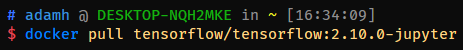

# Notes

**LOL SCRAP THAT**

## Osnova

- introduction
  - #TODO: fill this in

## Installation

Stuff needed for installation

### Prerequisites

1. A working computer (tablets not great, but you could Collab)
1. For training more complex models, you will need a graphics card, so it does not take ages. Tensorflow comes with support for Nvidia CUDA and the cuDNN (CUDA Deep Neural Network) library. Unfortunately, only Nvidia GPUs support CUDA, so you will need to find a solution for yourself to use a different GPU.

### Operating System

Before writing, I was wondering about the problem of operating systems. Let's look at what choices you have in 2022:

- Most machine learning is done on Linux. Why? Big models are run on very high performance hardware (many GPUs) - big servers or supercomputers. Operating system of these big machines is pretty much always Linux (Windows tends to crumble with this much compute installed). If you have a Linux OS running on your computer, you will feel right at home with machine learning.
- On Windows, this is a different story. TensorFlow version 2.10 (the latest one as of writing) is the last one that will support native Windows. This does not mean however, that there is no support for Windows. Tensorflow supports WSL2 - Windows subsystem for Linux - with DirectML. That is (to simplify) a Linux kernel running on top of Windows, meaning that all is very similar to command line Linux.
- MacOS has the worst support, as Macs don't really have powerful hardware to start with. No GPU training is available there, but CPU is still supported natively.

If you plan to do machine learning, but don't want to commit to a new OS, there is a different way - arguably even better than installing TensorFlow natively.

### Solution

The solution is **Docker containers**! Docker is a program that creates virtual machines (called *containers*), that are completely isolated from the outer operating systems. It has a lot of premade configurations including official *docker images* ("recipes" how to create containers with all needed installed) from TensorFlow.
This allows us to have the same virtualized environment (Linux) on every operating system, while being easy to download and replicate.

#### Secondary Solution

Another way to solve this problem would be [Google Collab](https://colab.research.google.com/), that provides Jupyter Notebook kernels running on Google's servers. They also have a GPU/TPU runtimes specifically for ML that are probably faster than your hardware at home. Collab has a free tier with before said features included, but it has limited compute time per day and is not as "hands-on" in my opinion, so I will not be using it in this tutorial.

### Steps to Install TensorFlow and Others

1. First install docker
    - Follow instructions on the [Docker website](https://docs.docker.com/desktop/)
    - On Windows, choose the WSL2 backend
1. Pull docker TensorFlow image
    - 
    - This pulls the CPU image with Jupyter.
    - Version of the image is the one used to write.
    - Change *2.10.0* to *latest* to pull the latest version (might not be compatible with code).
